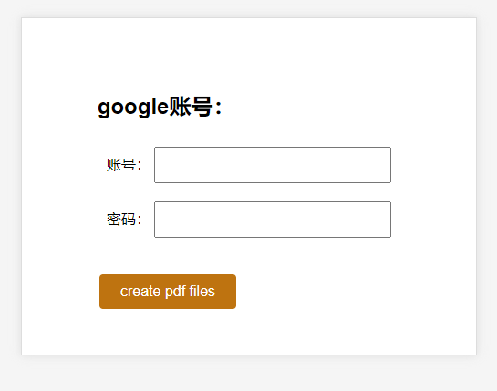
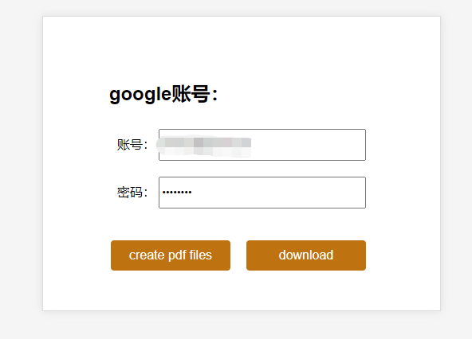

# web-trans-pdf

by `tworry`

## init

``` bash
yarn
```

## dev

``` bash
yarn dev
```

## main dependencies

- puppeteer
- express

## features

- headless chrome
- translation

## tips

- 只支持Google账户
- 因为Google账户登录限制，只能显示的运行puppeteer

## preview

> 首先需要输入Google账户密码，用以登录网站



> 在生成完pdf后，`download`按钮会出现，点击就能下载压缩包



> 部分pdf预览，完整保留了网页的样式

